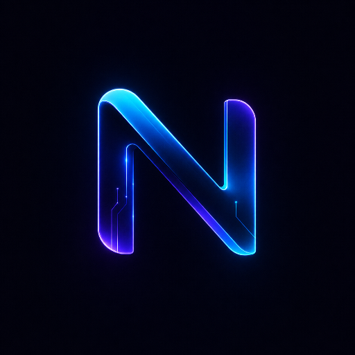

<div align="center">
  
  <h1>Neurova AI</h1>
  <p><strong>A secure, multi-model, multi-user AI companion for iOS & Android.</strong></p>

  <p>
    
    
    
  </p>
</div>

<br />

Neurova AI is a privacy-first, premium chat application designed to bring the power of multiple state-of-the-art LLMs right to your pocket. Built with React Native and Expo, it features isolated multi-user local storage, fluid native gesture handling, and a zero-compromise beautiful dark interface.

## ✨ Current Features

*   🧠 **Multi-Model Support:** Connect seamlessly to Gemini API or utilize OpenRouter to switch instantly between massive models like *Llama 3.3 70B, Qwen 3 Coder, MiniMax M2.5, and Nemotron 3 Super*.
*   🔐 **Local, Isolated Multi-User Profiles:** Complete offline SQLite database ensures your chat history stays exclusively on your device. Separate user profiles (plus a Guest Mode) keep conversations private and localized.
*   🛑 **Fluid Generation Control:** Stream responses in real-time with full AbortController support. Change your mind? Stop the AI mid-sentence with zero latency.
*   💅 **Premium Markdown & Code Rendering:** Beautifully formatted syntax highlighting, horizontal scrolling tables, blockquotes, and one-tap code copying.
*   📱 **Cross-Platform & Highly Optimized:** Heavily optimized `FlatList` virtualized rendering and fully anchored gesture bindings ensure crisp 60FPS scrolling, even through massive 100+ message chat histories.
*   🛠️ **Automated Build Pipeline:** GitHub Actions automatically spin up and split architecture-specific Android APKs (`arm64-v8a`, `armeabi-v7a`, `x86_64`) entirely for free on every release.

---

## 🗺️ Roadmap & Future Vision

Neurova AI is actively evolving. Our goal is to bring advanced, multi-modal, and edge-computed AI capabilities to mobile devices without compromising on battery or speed.

- [ ] **AI Memory Persistence:** The model will learn your preferences, code styles, and context across multiple distinct chat sessions.
- [ ] **Image Generation:** Native text-to-image synthesis straight within the chat bubble.
- [ ] **Vision Capabilities (Ask Image):** Snap a photo or upload an image and have the AI instantly analyze, debug, or describe the visual context.
- [ ] **On-Device Voice Mode:** Advanced natural language voice mode processed strictly on-device for zero-latency, private voice interactions.
- [ ] **Local Hardware Accelerated Models:** Complete detachment from the cloud. Download quantized open-source models (GGUF/MLX equivalents for mobile) and run them natively on your phone's Neural Processing Unit (NPU).

---

## 🚀 Getting Started

### Prerequisites
*   Node.js (v18+)
*   Expo CLI

### Installation

1. **Clone the repository:**
   ```bash
   git clone https://github.com/yourusername/neurova-ai.git
   cd neurova-ai
   ```

2. **Install Dependencies:**
   ```bash
   npm install
   ```

3. **Run the Development Server:**
   ```bash
   npx expo start
   ```

### Building for Release

Thanks to the automated GitHub Actions pipeline, you can simply create a **Release** on your GitHub repository. The workflow will automatically prebuild the Android architecture, invoke Gradle, and attach the lightweight, architecture-specific `arm64`, `x86`, and `Universal` APKs to your release for immediate sideloading.

---

<div align="center">
  <i>Built to push the boundaries of what a mobile AI client can be.</i>
</div>
